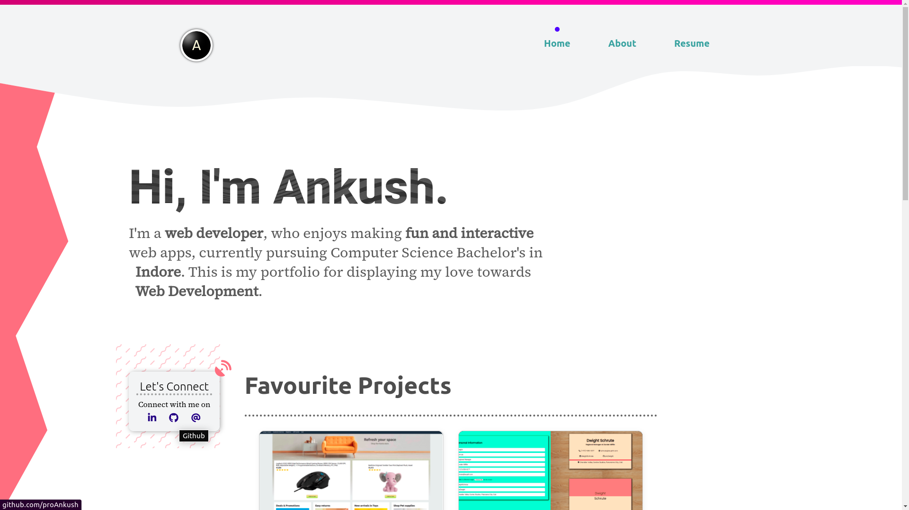

# [Ankush's Portfolio](http://portfolio-948da.web.app/)     

A portfolio website created for and by <em> Ankush Patil</em>.

- **Performant:** This website is created with performance in mind. It has received multiple tweaks and fixes for performance improvement and optimizations.
- **Minimalist:** The design follows minimalistic standards, such as small box-shadows not too bright/noticable but present to keep the content feeling alive.
- **Informative:** Includes personal social links, current/past projects the author has worked upon, the education and work background and most importantly a [Resume](http://portfolio-948da.web.app/resume).

<p align="center">
    
</p>
<br>

## Installation

This project is bootstrapped from create-react-app and follow similar workflow for replicating it.<br>
First clone the repository:

```properties
git clone git@github.com:proankush/portfolio
cd portfolio
```

And then to start the project in development mode on localhost 3000.

```properties
npm start
```

Or to deploy the project use

```properties
npm run build && firebase deploy
```
